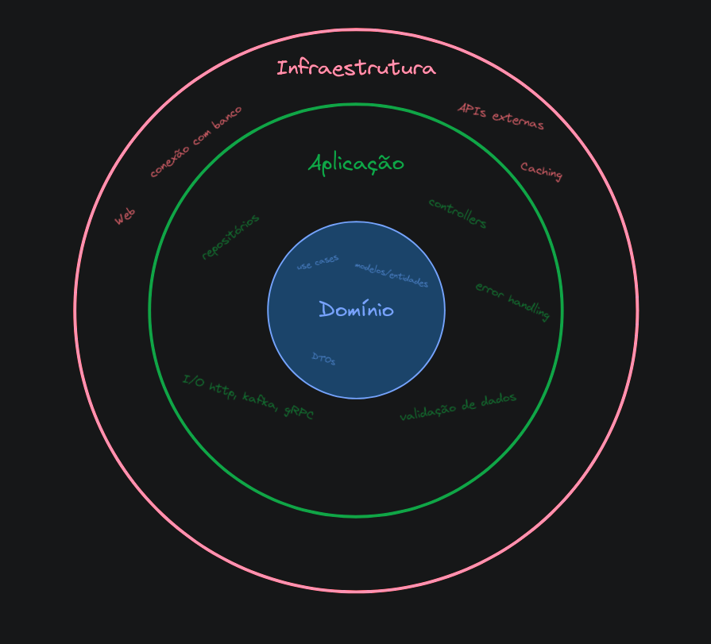

# Project Model

Esse projeto tem a finalidade de servir de base para a construção de aplicações Node.js.

A aplicação foi construida utilizando *domain-driven design* e pode ser **adaptada** para funcionar em diferentes contextos:

- [Servidor API](/adapters/api.md)
- [Biblioteca](/adapters/lib.md)
- ~~[Consumo de Eventos Kafka](/adapters/kafka.md)~~ (Em construção 🚧)
- ~~[Servidor gRPC](/adapters/grpc.md)~~ (Em construção 🚧)
- [Adapter Custom](/adapters/custom.md)

## Conceitos

O código é divido em 3 camadas:



1. Camada de infraestrutura, faz conexão com o mundo externo à aplicação, banco de dados, APIs.
2. Camada de aplicação, faz a comunicação (I/O) com quem está usando a aplicação, servidor HTTP, eventos Kafka, como biblioteca, tem como responsabilidade receber um *Input* e devolver um *Output*.
3. Camada de domínio, guarda as regras de negócio, o que deve acontecer quando ações são tomada, os modelos/entidades
  > Por exemplo: Um usuário só pode ter acesso à estatísticas avançadas caso esteja no plano pago. Então o usuário é uma **entidade** e ter o plano pago para acessar estatísticas avançadas é uma **regra de negócio**.

### Estrutura de pastas

O código da aplicação pode ser encontrado dentro da pasta [`/lib`](/lib/)

| Nome | Funcionalidades |
| --- | --- |
| application | Servidor Web, gRPC, Kafka, Biblioteca, CLI |
| domain | *Use cases*, modelos/entidades, exceções, *dtos* |
| infra | Banco de Dados, APIs, Cache, Acessar arquivos |


Conceitos adicionais:

- [Error Handling](#error-handling)
- [Validação](#validação)

## Error Handling

É responsabilidade da camada de **domínio**, mais especificamente das regras de negócio, de lançar exceções para a aplicação.

> É responsabilidade da camada de **aplicação** de tratar esses erros e informar o usuário final da aplicação sobre o que aconteceu.

Modelo de lançamento de exceções da camada de domínio:

```js
const DomainError = (message, status, options = {}) => {
  const error = {
    message,
    status,
    ...options,
  }

  return error
}
```

Exemplo de uso do modelo de exceção:

```js
const SaveStudentFail = (message = "Failed to Save Student") => DomainError(message, 400)

const createStudent = async (name) => {
  const student = new Student(name)
  
  try {
    await repository.save(student)
  } catch(error) {
    throw SaveStudentFail()
  }

  return student
}
```

Agora, na camada de **aplicação** é possível tratar essas exceções da seguinte forma:

```js
const isDomainError = (error) => error.hasOwnProperty("message") && error.hasOwnProperty("status")

try {
  const student = await createStudent("test")
} catch(error) {
  if(!isDomainError(error)) {
    return response.status(500).send({ error: "Internal Server Error" })
  }

  return response.status(error.status).send(error)
}
```

## Validação

A camada de domínio pode fazer uso de *models* para realizar a validação de seus dados.

> Ressaltando que a validação de dados é essencial para a camada de domínio, qualquer dado incorreto pode causar erros nas regras de negócio

Exemplo de construção de um model que se *auto-valida*:

```js
class Student {
  constructor(name) {
    if(typeof name !== "string") {
      throw InvalidStudentError()
    }

    this.name = name
  } 
}
```
> Saiba mais sobre tratamento de exceções em [Error Handling](#error-handling)

Exemplo de uso do model:

```js
const student = new Student(name) // <- modelo auto-valida no `constructor`
```

## Novidades

Clique aqui para acessar o [CHANGELOG](CHANGELOG.md)